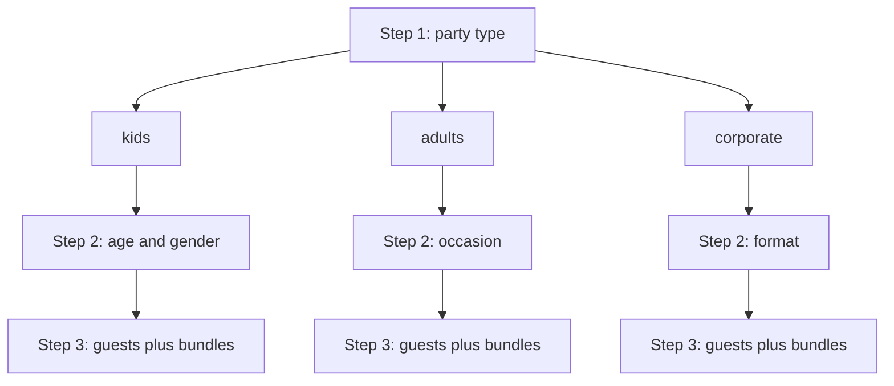

# Party Assistant

Multi-step wizard that asks about the user’s party, then recommends ready-made bundles (or, eventually, builds a custom party). Route: `GET /assistant` → `AssistantController#show`.

## Product intent

1. Collect party context (type, occasion/format or kids age/gender, then guest counts).
2. Recommend matching **ready bundles** from fixtures as soon as preferences are known.
3. Optionally **build a custom party** when no bundle fits (not implemented yet).

Guest counts live on the results step so users can size headcount against ready bundles. Prices are still static fixture strings and are not shown or scaled on cards yet.

## Flow

State lives entirely in **URL query params** (GET links + GET form). No session or DB writes.

| Step | View partial | What happens |
|------|--------------|--------------|
| 1 | `app/views/assistant/_step_party_type.html.erb` | Choose `adults`, `kids`, or `corporate` |
| 2 | `_step_preferences` (kids) or `_step_occasion` (adults/corporate) | Age/gender, or occasion/format |
| 3 | `_step_bundles` (+ `_guest_controls`) | Guest counts on top; matching ready bundles below |

`show.html.erb` switches on `@step` (and `party_type`) and shows a Back link from steps 2–3 that preserves preference query params (not guest counts).

### Party types (`AssistantController::PARTY_TYPES`)

| `party_type` | Step 2 | Step 3 |
|--------------|--------|--------|
| `kids` | `kids_age`, `kids_gender` | `kids_count`, `adults_count` + `Bundle.matching_kids(age:, gender:)` |
| `adults` | `occasion` (default `just-because`, kind `private`) | `adults_count`, optional `include_kids` + `kids_count` + `Bundle.matching_adults(occasion:)` |
| `corporate` | `occasion` (default `networking`, kind `corporate`) | `guests_count` + `Bundle.matching_corporate(occasion:)` |

Invalid or missing `party_type` on step ≥ 2 redirects to step 1.

### Query params

| Param | Meaning | Defaults |
|-------|---------|----------|
| `step` | Wizard step (1–3) | `1` |
| `party_type` | `adults` \| `kids` \| `corporate` | required from step 2 |
| `occasion` | Adults/corporate path: occasion or format slug | `just-because` / `networking` |
| `kids_count` / `adults_count` / `guests_count` | Headcounts (step 3) | UI defaults if blank |
| `kids_age` | Age 0–18 | `6` |
| `kids_gender` | `0` mostly boys, `1` mixed, `2` mostly girls | `1` |
| `include_kids` | Adults path: show kids counter when `"1"` | off |

## Occasions & formats

`Occasion` loads from `db/fixtures/occasions.yml` (fixture model, not ActiveRecord). Records share one model and are split by `kind`:

| `kind` | Used by | Meaning | Default |
|--------|---------|---------|---------|
| `private` | `adults` | Social occasions (Birthday, Housewarming, …) | `just-because` |
| `corporate` | `corporate` | Event formats (Networking, Coffee Break, …) | `networking` |

`Occasion.for_kind` / `Occasion.default(kind:)` scope options in the wizard. Private options were extracted from adult `parties` bundles in `bundles.yml`; corporate formats are product-defined.

Avoid naming the attribute `type` — that collides with Rails STI conventions; use `kind` instead.

## Bundle matching

`Bundle` loads from `db/fixtures/bundles.yml` (fixture model, not ActiveRecord).

### Kids

- Age → band via `Bundle.age_band_for` / `AGE_BANDS`: baby, toddler, preschool, kids, tweens, teens.
- Gender slider → allowed fixture genders via `GENDER_MATCHES`: boys/neutral, neutral, girls/neutral.
- `Bundle.matching_kids` keeps items under category `kids` whose `ages` include the band and whose `gender` is allowed.
- Guest counts are not used for matching.

### Adults

`Bundle.matching_adults(occasion:)` filters category `parties`:

- `just-because` → all parties bundles
- Subcategory shortcuts: `birthday` → `birthdays`; `baby-shower` / `christening` → `baby-family`
- Else title heuristic: normalized title includes the occasion name (e.g. housewarming → “Housewarming Feast”)
- Empty filter → fall back to all parties

### Corporate

`Bundle.matching_corporate(occasion:)` filters category `corporate`:

- Subcategory map: `conference` → `conference`; `product-launch` → `opening`
- Else / empty → all corporate bundles

Step 3 copy uses kids age band + gender label, or the selected occasion/format name. Cards render via `pages/product_card` and `bundle.to_h`.

## UI building blocks

| Partial / controller | Role |
|----------------------|------|
| `_guest_controls` | Step 3 headcount form (auto-submits on change) |
| `_guest_counter` | ± steppers (`number-stepper` Stimulus) |
| `_age_slider` | Age range + band chips (`slider`) |
| `_gender_slider` | Boys / mixed / girls (`slider` + labels) |
| Adults “There will be kids” | `reveal` Stimulus toggle |
| `_step_occasion` | Radio grid of occasions (adults) or formats (corporate) |
| `_step_preferences` | Kids age + gender (step 2) |
| `auto-submit` | GET form `requestSubmit` on `change` |

Slider styles use the `assistant-slider` CSS class.

## Key files

- `app/controllers/assistant_controller.rb` — steps, validation, matching
- `app/views/assistant/*` — wizard UI
- `app/models/bundle.rb` — fixtures + matching
- `app/models/occasion.rb` — private occasions + corporate formats
- `db/fixtures/bundles.yml` — bundle catalog
- `db/fixtures/occasions.yml` — occasion/format options
- `app/javascript/controllers/number_stepper_controller.js`
- `app/javascript/controllers/auto_submit_controller.js`
- `app/javascript/controllers/slider_controller.js`
- `app/javascript/controllers/reveal_controller.js`
- `config/routes.rb` — `get "assistant" => "assistant#show"`

## Working on the assistant

- Prefer extending the same GET/query-param wizard rather than introducing session state unless needed.
- New party-type outcomes should branch in `AssistantController#show` and a step partial; step 3 is always bundles + guest controls.
- Keep age bands and gender match tables in sync between `Bundle`, `_age_slider`, and `_gender_slider`.
- Custom-party builder and per-guest price scaling are open product work.
