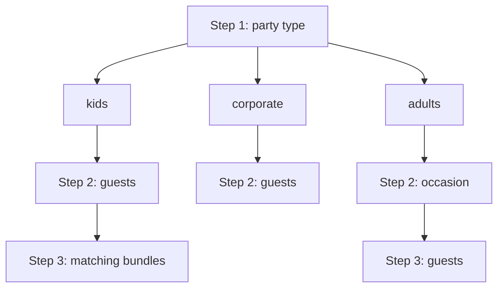

# Party Assistant

Multi-step wizard that asks about the user’s party, then recommends ready-made bundles (or, eventually, builds a custom party). Route: `GET /assistant` → `AssistantController#show`.

## Product intent

1. Collect party context (type, occasion for adults, guests, kids age/gender mix where relevant).
2. Recommend matching **ready bundles** from fixtures.
3. Optionally **build a custom party** when no bundle fits (not implemented yet).

Today only the **kids** path reaches bundle recommendations. Adults collect occasion + guest counts but do not yet advance to results. Corporate collects guest counts only.

## Flow

State lives entirely in **URL query params** (GET links + GET form). No session or DB writes.

| Step | View partial | What happens |
|------|--------------|--------------|
| 1 | `app/views/assistant/_step_party_type.html.erb` | Choose `adults`, `kids`, or `corporate` |
| 2 | `_step_occasion` (adults) or `_step_guests` (kids/corporate) | Occasion selector, or guest counts |
| 3 | `_step_guests` (adults) or `_step_bundles` (kids) | Guests for adults; matching kids bundles |

`show.html.erb` switches on `@step` (and `party_type`) and shows a Back link from steps 2–3 that preserves query params.

### Party types (`AssistantController::PARTY_TYPES`)

| `party_type` | Step 2 | Step 3 |
|--------------|--------|--------|
| `kids` | `kids_count`, `adults_count`, `kids_age`, `kids_gender` | `Bundle.matching_kids(age:, gender:)` |
| `adults` | `occasion` (default `just-because`) | `adults_count`, optional `include_kids` + `kids_count` |
| `corporate` | `guests_count` | Falls back to step 2 |

Invalid or missing `party_type` on step ≥ 2 redirects to step 1.

### Query params

| Param | Meaning | Defaults |
|-------|---------|----------|
| `step` | Wizard step (1–3) | `1` |
| `party_type` | `adults` \| `kids` \| `corporate` | required from step 2 |
| `occasion` | Adults path: occasion slug | `just-because` |
| `kids_count` / `adults_count` / `guests_count` | Headcounts | UI defaults if blank |
| `kids_age` | Age 0–18 | `6` |
| `kids_gender` | `0` mostly boys, `1` mixed, `2` mostly girls | `1` |
| `include_kids` | Adults path: show kids counter when `"1"` | off |

## Occasions (adults)

`Occasion` loads from `db/fixtures/occasions.yml` (fixture model, not ActiveRecord). Options were extracted from adult `parties` bundles in `bundles.yml` (birthdays, get-togethers, baby-family), plus **Just Because** as the default catch-all.

## Bundle matching (kids)

`Bundle` loads from `db/fixtures/bundles.yml` (fixture model, not ActiveRecord).

- Age → band via `Bundle.age_band_for` / `AGE_BANDS`: baby, toddler, preschool, kids, tweens, teens.
- Gender slider → allowed fixture genders via `GENDER_MATCHES`: boys/neutral, neutral, girls/neutral.
- `Bundle.matching_kids` keeps items under category `kids` whose `ages` include the band and whose `gender` is allowed.
- Step 3 copy uses the age band + gender label; cards render via `pages/product_card` and `bundle.to_h`.

## UI building blocks

| Partial / controller | Role |
|----------------------|------|
| `_guest_counter` | ± steppers (`number-stepper` Stimulus) |
| `_age_slider` | Age range + band chips (`slider`) |
| `_gender_slider` | Boys / mixed / girls (`slider` + labels) |
| Adults “There will be kids” | `reveal` Stimulus toggle |
| `_step_occasion` | Radio grid of occasions |

Slider styles use the `assistant-slider` CSS class.

## Key files

- `app/controllers/assistant_controller.rb` — steps, validation, kids matching
- `app/views/assistant/*` — wizard UI
- `app/models/bundle.rb` — fixtures + matching
- `app/models/occasion.rb` — adult occasion options
- `db/fixtures/bundles.yml` — bundle catalog
- `db/fixtures/occasions.yml` — adult occasion options
- `app/javascript/controllers/number_stepper_controller.js`
- `app/javascript/controllers/slider_controller.js`
- `app/javascript/controllers/reveal_controller.js`
- `config/routes.rb` — `get "assistant" => "assistant#show"`

## Working on the assistant

- Prefer extending the same GET/query-param wizard rather than introducing session state unless needed.
- New party-type outcomes should branch in `AssistantController#show` and a step partial, same as kids → bundles.
- Keep age bands and gender match tables in sync between `Bundle`, `_age_slider`, and `_gender_slider`.
- Custom-party / adults / corporate results are open product work; don’t assume step 3 exists for every type.
